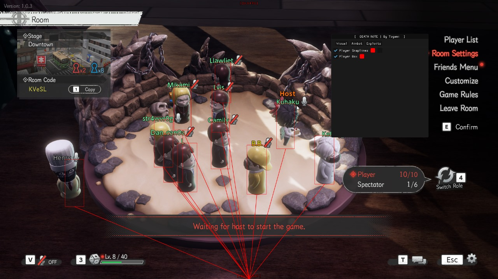
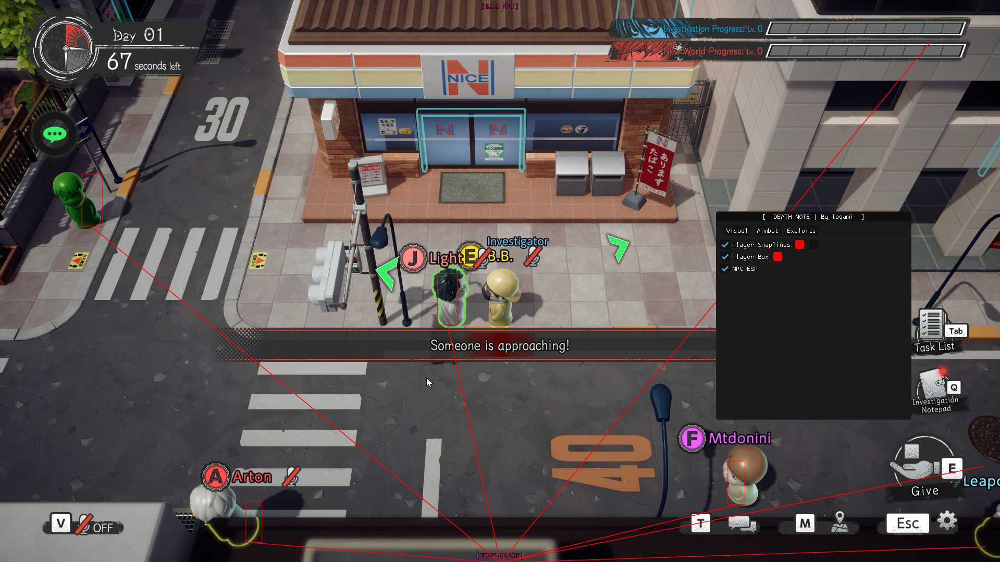

# Unity Game Hacking

- First time hacking Unity Games, so I'm going to document my progress here.

> Game: `DEATH NOTE Killer within`

> DISCLAMER: This is for educational purposes only. I am not responsible for any damage caused by this repository.

For now I was only able to make some basic stuff:

- [x] Player Box ESP
- [x] Player Snaplines
- [x] Local Player Checker
- [x] NPC ESP

I tend to add more features in the future, if you like this repository, please give it a star.

## Screenshots

## Il2CPP-Base

Base For Il2CPP Unity Game Hacking

Credits
RDBO -> ImGui DX11 Hook - https://github.com/rdbo/ImGui-DirectX-11-Kiero-Hook

IdolTheDev -> CodeBase - https://github.com/IdolTheDev/Il2CPP-Base